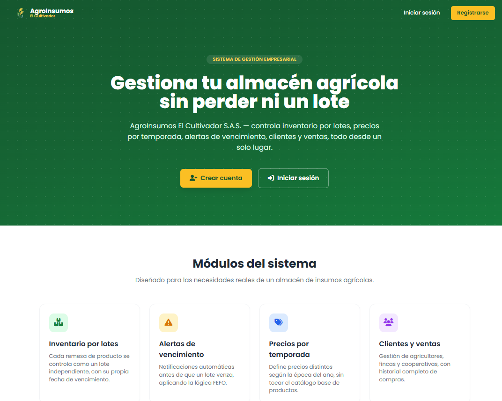

# SGE - Software de Gestión Empresarial

Proyecto Laravel del curso COTECNOVA - 2026.

## Capítulo 2: Instalación de Laravel

- **Entorno:** WSL2 (Ubuntu), PHP 8.3.6, Composer 2.10.2, Laravel v13.26.1.
- **Pasos seguidos:**
  1. Verificación de versiones instaladas (`php -v`, `composer --version`).
  2. Creación del proyecto: `composer create-project laravel/laravel sge`.
  3. Verificación de la estructura generada (`ls -la`).
  4. Primera ejecución del servidor local: `php artisan serve`.
  5. Confirmación de la pantalla de bienvenida en `http://127.0.0.1:8000`.
  6. Instalación de Laravel Sail (`composer require laravel/sail --dev`, `php artisan sail:install`) para levantar el entorno con Docker.
  7. Ejecución de migraciones (`./vendor/bin/sail php artisan migrate`) y modificación de la vista de bienvenida.
- **Capturas:** ver carpetas `Clase2/` y `Clase3/`.

### Estructura de carpetas

| Carpeta | Función |
|---|---|
| `app/` | Contiene el núcleo de la aplicación: Modelos, Controladores y la lógica de negocio. |
| `bootstrap/` | Archivos que "arrancan" el framework. No se modifica casi nunca. |
| `config/` | Todos los archivos de configuración de Laravel (base de datos, mail, caché, etc.). |
| `database/` | Migraciones, seeders y factories (para poblar la base de datos). |
| `public/` | Punto de entrada de la aplicación (`index.php`). Aquí van CSS, JS e imágenes públicas. |
| `resources/` | Vistas (Blade), archivos CSS/JS sin compilar. |
| `routes/` | Definición de todas las rutas (URLs) de la aplicación. |
| `storage/` | Archivos generados por Laravel (logs, caché, sesiones). |
| `vendor/` | Todas las dependencias instaladas por Composer. No se toca ni se sube a GitHub. |
| `.env` | Variables de entorno (configuración específica del entorno). No se sube a GitHub. |

### Diagrama del flujo de una petición

```
Usuario → Ruta (routes/web.php) → Controlador → Modelo → Base de Datos
                                                              ↓
Usuario ← Respuesta ← Vista ← Controlador ←──────────────────┘
```

Paso a paso, cuando un usuario escribe una URL en el navegador:

1. El usuario escribe, por ejemplo, `http://localhost/usuarios`.
2. El archivo `public/index.php` recibe la petición (punto de entrada de la aplicación).
3. Laravel busca en `routes/web.php` si existe una ruta para `/usuarios`.
4. Si existe, ejecuta el Controlador asociado a esa ruta.
5. El Controlador usa el Modelo para obtener datos de la base de datos.
6. El Controlador pasa esos datos a una Vista.
7. La Vista genera el HTML final.
8. Laravel devuelve ese HTML al navegador del usuario.

Este flujo sigue el patrón **MVC (Modelo-Vista-Controlador)**: el Modelo habla con la base de datos, la Vista es lo que el usuario ve, y el Controlador conecta a ambos, recibiendo la petición y decidiendo qué Vista mostrar.

### Variables de entorno

El archivo `.env` contiene las variables de entorno de la aplicación: configuraciones que cambian según el entorno (local, producción, etc.), separadas del código y nunca subidas a GitHub (está en `.gitignore`).

| Variable | ¿Qué configura? | Ejemplo |
|---|---|---|
| `APP_NAME` | Nombre de la aplicación | `SGE` |
| `APP_ENV` | Entorno (local, production) | `local` |
| `APP_DEBUG` | Modo depuración (true/false) | `true` |
| `APP_URL` | URL de la aplicación | `http://localhost` |
| `DB_CONNECTION` | Motor de la base de datos | `mysql` |
| `DB_HOST` | Host de la base de datos | `mysql` (nombre del servicio de Sail) |
| `DB_PORT` | Puerto de la base de datos | `3306` |
| `DB_DATABASE` | Nombre de la base de datos | `laravel` |
| `DB_USERNAME` | Usuario de la base de datos | `sail` |
| `DB_PASSWORD` | Contraseña de la base de datos | `password` |
| `FORWARD_DB_PORT` | Puerto expuesto hacia la máquina local (para evitar conflictos con otro MySQL) | `3308` |

**Importante:** cuando se usa Sail, `DB_HOST` debe ser `mysql` (el nombre del servicio en `docker-compose.yml`), no `localhost` ni `127.0.0.1`, porque la base de datos vive dentro de un contenedor Docker aparte.

## Capítulo 3: Autenticación y Personalización Visual

- **Autenticación:** implementada con Laravel Breeze (`composer require laravel/breeze --dev`, `php artisan breeze:install`, stack Blade). Se protegieron las rutas de los módulos (`products`, `categories`, `clients`, `sales`) con el middleware `auth`.
- **Campo adicional:** se agregó el campo `telefono` al registro de usuarios (migración `add_telefono_to_users_table`), validado como opcional en `RegisteredUserController`.
- **Capturas:** ver carpeta `docs/visual/` (`captura1_landing.png` a `captura6_nuevo_producto.png`).

### Captura de la Landing Page



### Explicación de los cambios visuales realizados

Se personalizó por completo la interfaz de autenticación y las vistas principales del ERP para reflejar la identidad de **AgroInsumos El Cultivador S.A.S.**:

- **Logo:** se reemplazó el logo por defecto de Laravel por un logo de texto propio (icono 🌾 + "AgroInsumos" / "El Cultivador"), reutilizado en el login, el registro y la barra de navegación (`resources/views/components/application-logo.blade.php`).
- **Login (`resources/views/auth/login.blade.php`):** título de página "Iniciar sesión - AgroInsumos El Cultivador", mensaje de bienvenida, íconos en los campos de correo y contraseña, y botón en el color de marca.
- **Registro (`resources/views/auth/register.blade.php`):** mismo estilo que el login, título "Crear cuenta - AgroInsumos El Cultivador", y un campo adicional de **Teléfono** propio del negocio.
- **Dashboard (`resources/views/dashboard.blade.php`):** mensaje de bienvenida personalizado (`¡Bienvenido, {{ auth()->user()->name }}!`) y 4 tarjetas de indicadores (KPIs): total de productos, total de clientes, ventas del día y productos con bajo stock. *Nota: estos 4 valores son de ejemplo, ya que los módulos de Productos, Clientes y Ventas todavía no tienen su modelo ni su tabla en la base de datos.*
- **Barra de navegación (`resources/views/layouts/navigation.blade.php`):** logo de la empresa, enlaces a los módulos principales (Dashboard, Productos, Categorías, Clientes, Ventas) con íconos, y un avatar circular con las iniciales del usuario en vez de solo texto.
- **Landing Page (`resources/views/welcome.blade.php`):** página de inicio nueva con sección principal (hero) con degradado verde, botones de "Iniciar sesión" y "Crear cuenta", tarjetas describiendo los módulos del sistema, testimonios ilustrativos y pie de página con información de contacto.
- **Formulario de producto (`resources/views/products/create.blade.php`):** se mantiene la misma línea visual (colores, tipografía, botones) que el resto del sistema, para mostrar coherencia visual aunque el módulo de Productos todavía no guarda datos reales.

### Paleta de colores utilizada

| Color | Uso | Clase de Tailwind |
|---|---|---|
| Verde oscuro | Fondo del login/registro y del hero de la landing page | `green-700` / `green-800` / `green-900` |
| Ámbar | Botones principales de la landing page y acentos | `amber-400` / `amber-500` |
| Blanco / Gris claro | Fondos de tarjetas y contenido | `white` / `gray-100` |
| Gris oscuro | Textos principales | `gray-800` / `gray-900` |

### Fuentes y recursos utilizados

- **Tipografía:** [Poppins](https://fonts.google.com/specimen/Poppins) (Google Fonts).
- **Íconos:** [Font Awesome 6](https://fontawesome.com/) (vía CDN de cdnjs).
- **Estilos:** Tailwind CSS (incluido por Laravel Breeze).
- **Logo:** logo de texto propio (sin archivo de imagen), hecho directamente en Blade + Tailwind.
